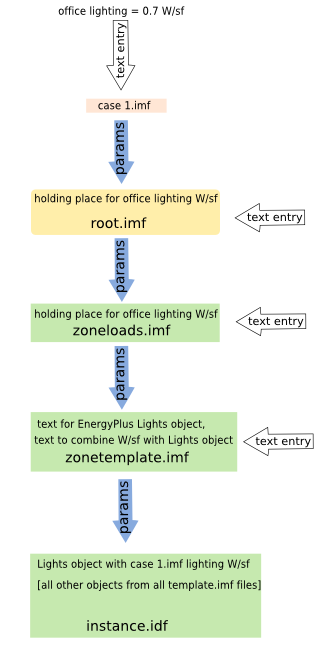

% 1
% Big Ladder Software
% 2013.10.01

# Params for EnergyPlus 

### Contents
- Overview of the Params software tool.
- Templates.
- Case files.
- Data flow.
- The Root file.
- Root file Advanced Features.
- Geometry.
- Possibilities.

\newpage

### Overview of the Params for EnergyPlus Software Tool

In its most basic concept, Params for EnergyPlus is a system of EnergyPlus templates.  The system uses a main or root file that gathers the templates of your model together and manipulates them into EnergyPlus input files.  

It uses language native to EnergyPlus, so  no features of the calculation engine are sacrificed. Nothing is hidden, masked or unavailable to the modeler.   However, the modeler must get comfortable "speaking" EnergyPlus language to a certain degree. The modeler must also have a small degree of programming knowledge. If you can use a spreadsheet, you can use Params for EnergyPlus.

\begin{mdframed}[hidealllines=true,backgroundcolor=gray!20,innerleftmargin=3pt,innerrightmargin=3pt,leftmargin=-3pt,rightmargin=-3pt]

Many companies decide to have only one or a few modelers trained in this programming knowledge for the initial set-up of their modeling systems and then only dive into it for maintenance when needed.  After that, everyday HVAC design loads modeling need not involve text document creation.

\end{mdframed}

### Templates

Many modeling tasks and building components are repetitive or consistent from project-to-project.  For example, office buildings have a usual set of space types with fairly typical schedules and loads.  The input for these schedules and loads can be made into parameters that are changed for each project.  

This is what templates do. Params for EnergyPlus includes libraries of space type load templates, HVAC systems templates and HVAC plants templates. New templates are constantly being added. 

The library includes a few mandatory templates. These include all header information that is required to set up an EnergyPlus input file. These are the general template, location template and output template.

The Ideal Loads template can be used to evaluate building loads apart from any assigned HVAC systems. In other words, the loads of a completely passive building. This is obviously very useful in sizing HVAC systems or in designing additional passive measures such as increased insulation or solar walls before any mechanical systems are added.

The work involved with the Params for EnergyPlus template system is in pulling these templates together and referencing the parameters that get inserted.

### Case Files

The way Params  for EnergyPlus feeds input data into EnergyPlus input files (or IDF files - Input Data Files) is through case files. A case file includes only the parameters and data that are different from the base modeling case. This makes it very easy to see what has changed from one case to another. Examples of different cases would be "ASHRAE 90.1-2007" or "Improved Lighting."  Each of the case files produces one "instance" (or one model) of EnergyPlus.

### Data Flow

*Illustration of data flow for the office lighting power density parameter*

In a text-based system such as Params for EnergyPlus, data entry is made in the case file which is then passed on through the root file to the template files and then out into one large EnergyPlus input file. 

Their are multiple reasons for this. The first is the advantage of data entry isolation. Each separate case file contains all and only the information that is being changed in that case. This gives the modeler complete control over the parameters without having to search through a multitude of dialog menus, drop down menus, and entry fields to diagnose or debug a model. Also, once a template is perfected, it can be saved and protected in a isolated file.

The second is that this gives the root file complete control over all inputs. Some data can be merely passed through the root file, but it can also be manipulated by the root file. For example, if a template file uses "outside air rate" as a parameter, the root file can call different outside air rates as input values for different cases. Case 1 could use existing values, Case 2 could use ASHRAE 62.1-2010 values and Case 3 could use demand ventilation.

Another advantage to this data flow is that multiple modelers can work on one project at a time. For example, one modeler might be in charge of collecting and inputting load data into the loads templates and another could be collecting and inputting HVAC data into those templates.

Because the template files are closely related to EnergyPlus input files, Params for EnergyPlus uses an ".imf" as the extension for the template, case and root files. You will see these files contain text that includes the EnergyPlus language in them in addition to Params-specific language and embedded Ruby script. You can consider the template files as building blocks or customized parts of the final IDF files.

The Params for EnergyPlus software helps you organize your output data by creating a separate folder for each case. Before being processed through EnergyPlus, these folders contain only the EnergyPlus input file for that case. These input files are called instance.idf and its folder is named after the case file. So, "New Boiler.imf" case file creates  a "New Boiler" folder under the Params "runs" folder with "instance.idf" inside of it. Then when EnergyPlus is run, it places all output files in the same folder as the input file.

### The Root File

The root file tells Params for EnergyPlus how to bring all of the templates and parameters together to output an EnergyPlus input file.  It can be a simple file that calls a single instance of all necessary energy modeling input data: weather, geometry, loads, HVAC and domestic hot water or it can be as complicated as necessary to include multiple HVAC systems and plants options that are switched on and off via case files.

It is best to structure root files in a similar way from model-to-model for consistency among modelers and because some root functions logically follow others. The recommended root file structure follows model building in a traditional fashion.  First, unique building and modeling information is included such as location and general information.  Then, a construction template and geometry template define materials, constructions and geometry. These are followed by loads templates which are followed by HVAC systems templates and if necessary, HVAC plant templates. Lastly, the output template defines what information is output and in what format. 

The only exception to this traditional sequence is that the beginning of the root file holds all of the parameters that are available for data entry. 

### Root File Advanced Features

A few easy-to-learn advanced features in the root file open up Params to almost every conceivable option.   These features automate routine procedures and give users the flexibility to customize everything.  Data and templates can be passed through the root file using "For" and "If" statements. "For" statements create loops that perform the same function over and over so the user does not need to copy data entry over and over. "If" statements evaluate conditions and perform one function in one case and another in another case. This allows many different cases to use one root file. 

### Geometry

Most energy modelers would agree that geometry creation and editing consume a large part, if not most, of their modeling time.  Params uses the popular architectural 3D modeling tool, SketchUp and the Legacy OpenStudio plugin to create the geometry template.  This geometry can then be edited in SketchUp or in a text editor. The text editor option allows geometry to be parametric.  For example, building rotation is an easy parameter to add. Window lengths and heights are easily changed with parameters. There are no limitations.

### Posibilities

Using EnergyPlus with Params affords the modeler complete customization and automation without any loss or limitation in EnergyPlus capability. The Params library is free and open and continuously growing. The idea is that it will expand organically as new templates are needed.  An initial fee is charged by Big Ladder Software, the creator of Params, for new templates not already available, but once they are created they are freely available to all future users.  Proprietary templates with licenses can be created for an additional fee and royalties.
  
